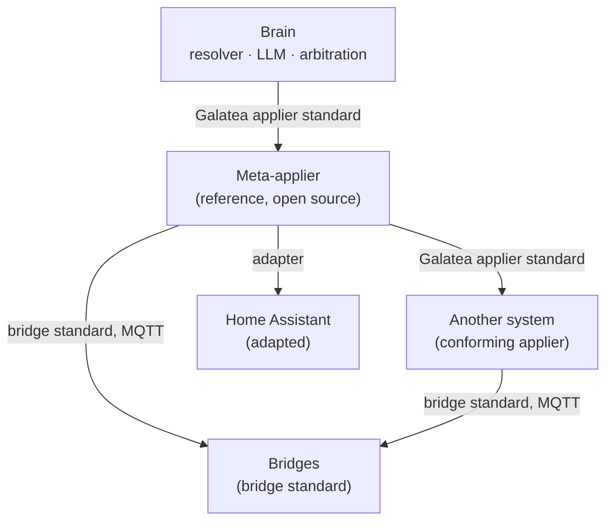

# The Galatea applier standard — design

## Changelog

| Date | Version | Change |
|---|---|---|
| 2026-09-24 | 0.4 | The standard's text now exists (`standard/applier.md`) and supersedes this spec's detail wherever the two differ; its changelog records each departure (among them: `plan` changes no leases either, GA-PLAN-1; the request field `channel` is `via`). This spec stays the record of why |
| 2026-09-24 | 0.3 | After re-review: a child's liveness is judged by an unanswered call, not by silence, and the meta-applier caps its `wait` on children; Scenarios-level subjects ship a declared fixture set, and GA-SCN-4 moves to Full with schedules; GA-SCN-5 is static only; selectors never match groups; GA-SAFE-4 for notify handed up by a safety rule; the simulated home has a momentary-relay gate; requirement ids are stable |
| 2026-09-24 | 0.2 | After spec review: safety rules may live in the reference applier; `delivered` ends stateless actions; device classes key tier defaults; an idempotency column; scenario plans and who a run acts as; step-reason order; level-triggered rules re-evaluate on lease expiry; selectors instead of room targets; endpoints are not targets; child registration and cycle detection; simulated children in the harness; `lease.acquire`/`release` dropped; a gap map to the reference scenarios |
| 2026-09-24 | 0.1 | First draft, from the appliers research, its two rulings and the twelve reference scenarios |

**Brainstorming path: architectural.** This is a new standard in a new repository.
There is no existing flow to change, and other components will depend on its
interface.

## What this is

The Galatea applier standard is the contract between the **brain** and an
**applier**. The brain is the resolver, the LLM and voice arbitration. The applier
is whatever owns the home's targets and changes them.

The maintainer's rulings on 2026-09-24 fix its frame:
- **The standard belongs to no one implementation;** an existing system is one implementation of it.
- Any applier that conforms is fully controllable by the brain.
- An open-source reference applier is built to it.
- It carries the Galatea name.
- The open-source reference applier is a **meta-applier**: its own devices come in
  through bridges, and other appliers are its children.

It sits beside the bridge standard, not inside it:

- **Brain to applier:** this standard.
- **Applier to bridge:** the bridge standard (`standard/bridge.md`). This standard
  does not restate it. It relies on that standard's freshness and death rules for
  liveness.
- **Meta-applier to child:** this standard again, because a child is an applier.

## What this spec covers, and what it does not

**Covered:**
- the model;
- the operations;
- their semantics;
- the conformance levels;
- the requirement index and how requirements are checked;
- one normative binding (MCP).

The deliverable of the plan that follows this spec:
- the standard's text;
- JSON Schemas for every operation;
- the requirement manifest;
- a conformance harness with a simulated home.

**Not covered.** Each gets its own spec:
- The reference meta-applier itself.
- The Home Assistant adapter.
- Bringing any existing system to conformance.
- The brain's resolver, LLM path and arbitration.
- Pairing new devices, which is below the standard (bridges and coordinators).
- **Speaker identity.** The standard carries a principal and a verification flag;
  how a voice becomes a verified person is the tabled speaker-gate work.

## Approaches considered

| Approach | Verdict |
|---|---|
| **Transport-neutral operations with JSON Schemas, plus an MCP binding** | ⭐ **Chosen.** The semantics outlive any transport; MCP is what every engine and LLM host already speaks |
| An MCP tool profile, where the tools *are* the standard | Rejected. It ties the semantics to MCP's churn (Home Assistant renamed every tool in 2026.9), and MCP's tool annotations are hints the client "should not blindly trust" |
| W3C WoT Thing Description plus extensions | Rejected as the base. TD describes affordances only: no plans, outcomes, tiers, leases or scenarios. Its shape is borrowed for Describe |
| A shared event log that the brain and applier both write | Rejected. It moves the single-publisher rule from a place (the applier) to a convention (who writes what), and conventions are what a deployed fleet's history shows eroding |

## The model

All terms are defined in `CONTEXT.md`.

### Home, rooms, targets

- **A home** has an id, a name and a **revision**: a monotonic integer that
  changes on any change to the model, never on state changes.
- **Rooms** have an id and a name.
- **Every target** has:
  - an id, unique within the applier;
  - a name, and optional aliases;
  - an optional room;
  - a **kind**: `device`, `group` or `channel`.
- **A device** has:
  - capabilities;
  - an optional **class** from a closed list: `light`, `socket`, `ac`, `boiler`,
    `floor_heating`, `curtain`, `gate`, `garage_door`, `door_lock`,
    `water_valve`, `gas_valve`, `tv`, `speaker`, `sensor`;
  - a liveness;
  - under a meta-applier, the child that owns it.

  The class tells a gate from a curtain (both `cover`) and a boiler from an AC
  (both `climate`). Tier defaults and selectors use it.
- **A group** has:
  - members (target ids);
  - an **aggregate rule**, `any` or `all`, which says when the group reads as on;
  - an `exclusive` flag: no member of an exclusive group may belong to another
    exclusive group.
- **A channel** has one action, `notify`.
- **Endpoints are not targets.** Describe lists them separately (id, name, room,
  `voice` or `panel`), so the brain knows where a satellite or panel is. Nothing
  can be applied to one.
- **Rooms are not targets either.** A request reaches a room through a
  **selector** (see *Plan and apply*).

### Capabilities and actions

- **The vocabulary is closed and versioned** with the standard.
- **A capability** is a name plus its actions and state keys. Version 0.1 has:

| Capability | Actions | State | Idempotent by default |
|---|---|---|---|
| `onoff` | `turn_on`, `turn_off` | `on` | yes |
| `level` | `set_level(0–100)` | `level` | yes |
| `color` | `set_color(rgb)` | `color` | yes |
| `climate` | `set_mode(off/heat/cool/auto/fan)`, `set_setpoint(°C)` | `mode`, `setpoint`, `current` | yes |
| `cover` | `open`, `close`, `stop`, `set_position(0–100)` | `position` | yes |
| `media` | `pause`, `resume`, `set_volume(0–100)`, `duck(on/off)` | `playing`, `volume` | yes |
| `valve` | `open`, `close` | `open` | yes |
| `lock` | `lock`, `unlock` | `locked` | yes |
| `sensor` | — | one declared key (temperature, humidity, motion, contact, leak, occupancy) | — |
| `notify` | `notify(text, urgency: info / warning / critical)` | — | **no** |

- **Idempotency is declared per action on each target,** defaulting to the
  capability's column. A target may declare an action non-idempotent where the
  device implements it as a toggle or a pulse. A gate on a momentary relay is the
  usual case: its `open` is a pulse, and a second pulse closes it.

- **Each action on each target declares its tier.** The standard gives defaults,
  keyed on capability, action and class only, so a static check can compute them.
  An applier may raise a tier but never lower it.

| Class | Action | Default tier |
|---|---|---|
| any | `lock.unlock` | `no_voice` |
| `water_valve`, `gas_valve` | `valve.open` | `no_voice` |
| `gate`, `garage_door` | `cover.open`, `cover.set_position` | `no_voice` |
| `boiler` | `climate.set_mode`, `climate.set_setpoint` | `confirm` |
| any other | any other | `reversible` |
- **Safety is a property of a rule, not a tier.** What makes the leak rule
  special is that it runs without the brain and can't be leased away. Closing a
  valve isn't dangerous; the rule that must close it is critical (see *Scenarios,
  rules, schedules*).
- **A vendor's own actions** (a kiosk's `screensaver`, `play_media`, `showcase`, …)
  are an **extension capability**, such as `vendor.kiosk`. Extensions are namespaced, described by
  the same schema, and allowed at every level.

### State, liveness, witnesses

- **Every state value carries its basis time,** the time of the observation, never
  of publication, as the bridge standard requires.
- **Every device carries a liveness:**
  - `live`: observed within its freshness bound;
  - `stale`: past the bound, owning bridge alive;
  - `dead`: the owning bridge or child has died, by its will or by the child's own
    report.
- **An action on a target can name a witness:** a sensor whose change is
  expected to follow the action, and within how long. The witness belongs to the
  target and action, not to the capability, because the sensor is specific to the
  room. An IR-driven AC's `set_mode(cool)` names the room's temperature sensor,
  `falls`, and 15 minutes.

### Principals, channels of request, roles

- **Every request to change something names a principal.**
  - A person: a person id and a role.
  - A scenario run started by a schedule.
  - A rule.
  - Or `external`: a change the applier observed but did not make. This includes
    physical controls and other controllers, such as Алиса.
- **It also names the request channel** it came through (`voice`, `panel`, `app`,
  `scenario`, `rule`, `schedule`) and whether the person is **verified**.
- **The trust boundary:** a client authenticates to the applier with a token.
  Tokens the owner has registered for the brain and for panels carry the right to
  *assert* the person, channel and verification. The applier trusts those
  assertions from such a token, and from nothing else. A token without the right
  acts as the person it was issued to, with channel `app`.
  - A panel can therefore press "Ушли" (HS2) without the brain.
  - The brain is not a gate an applier depends on.
- **Roles (version 0.1):**

| Role | Can do |
|---|---|
| `owner` | Every tier; author scenarios, rules, schedules, groups, names and rooms |
| `member` | Every tier except authoring |
| `guest` | `reversible` only |

  Per-role time windows (a child after 22:00, HS9) are not in 0.1. They're
  expressible as a rule that refuses, once rules can refuse, which is left open.

### Tiers

| Tier | Runs when |
|---|---|
| `reversible` | Always, subject to leases and role |
| `confirm` | Only through a plan the principal has confirmed (see *Plan and apply*) |
| `no_voice` | Never when the request channel is `voice`, verified or not. Otherwise as `confirm` |

**Authored work carries its author's confirmation.**
- A rule, or a scenario run by a schedule, acts as its own principal.
- Its `confirm` and `no_voice` steps count as confirmed by the `owner` who
  authored it through `define`. Authoring is the confirmation, and `define`'s dry
  run is where it was read back.
- A scenario run by a person acts **as that person** (see *Who a scenario run acts
  as*). Its steps are held to that person's role and request channel. A `no_voice`
  step in a voice-started run is refused, whoever authored it.

### Leases

- **A lease is:**
  - a holder: a principal;
  - a set of targets;
  - a precedence;
  - an expiry: a time, the end of a scenario run, or the holder's next change.
- **Precedence, highest first:**
  1. safety rule;
  2. person, including `external`, and a scenario run a person started;
  3. a scenario run a schedule started;
  4. rule.
- **How leases arise:**
  - A person's apply takes a lease on what it changed, for a **hold time**
    (default two hours, configurable per home), or until the next change by a
    person.
  - An observed external change takes the same lease, held by `external`.
  - A scenario run leases every target it declares as owned, until the run ends.
    This is Full level: at Scenarios level a run declares what it owns but nothing
    enforces it.
  - Rules do not take leases.
- **Apply against a leased target:**
  - A lower-precedence principal gets `refuse(leased)`, naming the holder.
  - An equal or higher one proceeds, and replaces the lease.
- **When a lease ends,** its targets are re-evaluated by every **level-triggered**
  rule that names them. A level-triggered rule's trigger is a state held for a
  duration ("no motion in the hall for 3 minutes").
  - A condition that still holds fires the rule then.
  - Edge-triggered rules (a state *changing*) are not re-run.
  - This is HS3: the hall light, held by Дмитрий's switch, goes off when the hold
    ends, because the hall has been empty for longer than three minutes.

### Scenarios, rules, schedules

- **A scenario** has:
  - an id and a name;
  - steps: actions (on ids or selectors), delays, waits on a state, and runs of
    other scenarios;
  - a **mode**: `single`, `restart`, `queued` or `parallel`, as Home Assistant
    defines them. Describe lists the modes an applier supports; an adapter may
    support fewer;
  - a declared **owned** target set, leased while it runs;
  - `respect_occupancy`, applied to its action steps.
- **Who a scenario run acts as.**
  - A run started by a person, from a panel, a voice request or the app, acts as
    that person, at person precedence. Ольга's "Ушли" (HS2) replaces a family
    member's lease on the kettle.
  - A run started by a schedule acts as the scenario, at the lower precedence.
- **A scenario run is planned first.** `scenario.plan` returns one step per
  action-step target, evaluated against current state as a preview, with its
  asks. `scenario.run` takes the plan id and the answers.
  - Unanswered asks become `skipped(not_confirmed)` for the whole run.
  - Steps after a delay are re-checked when they execute, for leases, liveness
    and `already`, but not for tier or role. Those were settled when the run
    started.
  - A scheduled run has nobody to answer an ask. Its `confirm` and `no_voice`
    steps are pre-confirmed by authorship. An `ask(occupancy_unknown)` becomes
    `skip(occupancy_unknown)`. A schedule never acts on a room it cannot see.
- **A rule** has:
  - a trigger (a state change, an event, a time);
  - conditions over state;
  - actions, which may include notify;
  - `active`;
  - `safety`.
- **A safety rule:**
  - must be resident in the applier that owns every one of its **actuated**
    targets (the valves). Its `notify` actions are not part of the safety
    guarantee;
  - runs without the brain;
  - issues each action once, with no blind reissue;
  - requires its actuations to end `acked` or `failed`.
- **Notify from a safety rule is best effort.**
  - If the host applier owns the channel, it delivers.
  - Otherwise it emits a `rule_fired` event, and the applier above it (or the
    brain) delivers (GA-SAFE-4). HS4's leak rule is therefore a safety rule
    wherever Telegram lives. Only the valves must be local.
- **A schedule** triggers a scenario at a time on given days, with **exceptions**:
  a date on which it is skipped, or moved to another time.

### Cause and audit

- **Every state change the applier reports carries a cause:**
  - `apply` (with its id and principal);
  - `scenario` (with its run id);
  - `rule`;
  - `schedule`;
  - or `external`.
- **The audit is queryable by target and time,** and returns the causes in order.
  It's how the brain answers «почему свет выключился сам?» (HS3).

## The operations

Every operation is request and response, with JSON Schemas in the standard. Errors
are for requests the applier cannot understand. What happened to targets is
always an outcome, never an error.

| Operation | In | Out | Level |
|---|---|---|---|
| `describe` | optional `since_revision` | The home model: rooms, targets, endpoints, groups, capabilities, classes, tiers, idempotency, witnesses, scenarios (with supported modes), rules and schedules in summary, roles, children; `applier_id`; `descendants` (the ids of every applier below it); `revision`; `standard_version`; `levels` | Act |
| `state` | target ids, or none | Values with basis times, liveness, active leases | Act |
| `plan` | a request: actions on target ids or selectors, principal, request channel, options (`respect_occupancy`) | A plan: id, expiry, the revision it was made at, and one step per resolved target | Act |
| `apply` | a plan id and confirmation, **or** an inline request (which is planned and applied in one call); an idempotency key | Outcomes per target; an apply id | Act |
| `outcome` | an apply id | The current outcomes for it, including late `acked` and witness results | Act |
| `events` | a cursor; optional long-poll wait | State changes with causes, late outcomes, lease changes, liveness changes, rule firings; a new cursor | Act |
| `history` | target ids, a time range | The audit: causes in order | Act |
| `scenario.list` / `plan` / `run` / `stop` / `status` | ids; principal; for `run`, a scenario plan id and answers | Summaries; a scenario plan; a run id; run status | Scenarios |
| `lease.list` | targets | Active leases with holders and expiries | Full |
| `define` | a change set: upserts and deletes of scenarios, rules, schedules and exceptions, groups, target names, aliases and classes, rooms, **children** (id, address, credential reference), **routes** (which child reaches a device reachable through several); the expected `revision`; `dry_run` | Dry run: a readable diff. Otherwise the new `revision` | Full |

`lease.acquire` and `lease.release` were in 0.1 and are dropped. No scenario or
brain flow needs them: leases arise from applies, external changes and scenario
runs.

### Plan and apply

- **A plan step is one of four** (the resolver's *decide, ask, refuse*, plus
  *skip*):
  - `op`: what will be done;
  - `skip(reason)`: nothing to do. Reasons are `already`, `occupied`,
    `occupancy_unknown` (scheduled runs only), `unknown_target`,
    `unsupported_action`, `dead`;
  - `ask(reason)`: needs the principal's answer. Reasons are `confirm_tier` and
    `occupancy_unknown`;
  - `refuse(reason)`: will not be done. Reasons are `leased`, `tier`, `role`,
    `duplicate_route`.
- **Reasons are evaluated in a fixed order, and the first that applies wins:**
  1. `unknown_target`;
  2. `unsupported_action`;
  3. `dead`;
  4. `duplicate_route`;
  5. `role`;
  6. `tier`;
  7. `already`;
  8. `leased`;
  9. occupancy.

  So a kettle already on and held by Алиса is `skip(already)` (HS8): nothing
  needs doing, so there is no conflict.
- **Targets are ids or selectors.** A selector is `{room?, class?, capability?}`,
  with at least one field, and the applier resolves it.
  - «Выключи свет» from the living-room satellite becomes
    `{room: living, class: light}` (HS5).
  - "Ушли" uses `{class: light}`, `{class: socket}` and `{class: ac}` (HS2).
  - A resolved target is each id a selector expands to. A wildcard target such
    as `all-light` is a selector under another name.
  - **A selector matches devices and channels, never groups.** A group is
    reached only by its id, so `{capability: onoff}` gives a light one step, not
    a second one as a group member.
  - **Resolution is the applier's job,** so
    the brain never needs the full target list to act.
- **Every step says whether it is `real` or `emulated`.** An adapter that can't
  plan natively emulates the plan against its description.
- **An applier that does not claim Full treats every room as `unknown`.**
  `respect_occupancy` then yields `ask(occupancy_unknown)` for every room it
  touches, never silently ignored.
- **A plan expires** (default 60 s) and is bound to the revision it was made at.
  - Applying an expired plan, or one made at an older revision, is a request
    error.
  - Applying a plan with `ask` steps requires a confirmation that answers each of
    them. Unanswered asks become `skipped(not_confirmed)`.
- **Apply returns within a bounded time** (a requirement names it), with each
  target at one of:
  - `applied`: dispatched;
  - `skipped(reason)`;
  - `refused(reason)`;
  - `unreachable`.
- **Later outcomes arrive through `outcome` and `events`:**
  - `acked`: confirmed by the device's own reported state;
  - `delivered`: for an action with no state (`notify`), the channel reports
    delivery. It is that action's terminal success, as `acked` is for a stateful
    one;
  - `failed(reason)`;
  - `confirmed` or `unconfirmed`: by the witness.
- **Voice latency depends on apply's synchronous half only.**

### Idempotency and reissue

- **The same idempotency key yields the same apply,** never a second dispatch.
- **An applier must not reissue** a dispatched command on an ack timeout for any
  action its target declares non-idempotent (see the capability table's last
  column, and the per-target override). A gate on a momentary relay is the
  example: a second pulse closes it again.
- Reissuing an idempotent action is allowed, and bounded by the same idempotency
  key.
- A deployed dispatcher that reissued after 1 s ran commands two and three times;
  this rule forbids it.

### Occupancy

- **A room is `occupied`, `vacant` or `unknown`,** from its occupancy or motion
  sensors and a hold time.
- **With `respect_occupancy`, a plan's steps in a room become:**
  - `skip(occupied)` if the room is occupied;
  - `ask(occupancy_unknown)` if it's unknown.
- A room with no sensor is always `unknown` (HS2).

## The meta-applier

A meta-applier is an applier, so everything above applies to it. In addition:

- **GA-META-1.** Its Describe is the union of its children's. Target ids are
  namespaced by child unless mapped (GA-META-2).
- **GA-META-2.** A physical device reachable through more than one child is one
  target, with one chosen **route**.
  - Routes are part of the model, authored with `define` (`routes`).
  - Children report each device's stable identifier (a Matter unique id or a
    Zigbee IEEE address) in describe.
  - A meta-applier that sees one identifier under two children without a route
    actuates neither, until a route is defined. Plan steps for either target are
    `refuse(duplicate_route)`, and an event says which children and which
    identifier.
- **GA-META-3.** A meta-applier refuses to host a safety rule whose actuated
  targets belong to a child; that rule belongs in the child. A safety rule over
  the meta-applier's **own** devices (the ones its bridges bring in) is hosted by
  it like any applier. That is the flat in HS4, where the reference applier has
  no children.
- **GA-META-4.** Plans carry `real` or `emulated` per step, from the child.
- **GA-META-5.** Children are registered with `define` (`children`). Every
  applier has a stable `applier_id`, and describe lists its `descendants`. On
  registration, the meta-applier calls the child's describe, and refuses the
  change if its own id is the child's id or among the child's descendants.
- **GA-META-6.** Commands issued to a child directly, around the meta-applier,
  reach it as events with cause `external`. It records them and leases
  accordingly, and does not undo them.
- **GA-META-7.** A child is judged by whether it answers, not by whether it has
  news. The meta-applier polls each child's `events` with a `wait` of at most
  5 s, so a healthy, quiet child answers empty within 5 s.
  - A child is dead when a call to it has gone 10 s without an answer, or its
    connection is refused. Its targets read `dead` within 1 s of that.
  - They read back live on the child's next answer.
  - A long-poll held open inside its `wait` is not silence.
- Scenarios, rules, schedules and leases that span children live in the
  meta-applier. It's the one place that sees all of their targets.

## Conformance levels

| Level | Required operations | Who reaches it |
|---|---|---|
| **Act** | `describe`, `state`, `plan`, `apply`, `outcome`, `events`, `history`, plus tiers, liveness and idempotency | Every conforming applier. Adapters, with emulated plans and tiers enforced only for requests that go through them |
| **Scenarios** | Act, plus `scenario.*` | Existing systems with a scenario runner; the reference applier; adapters for engines that can run a named unit (HA scripts, openHAB rules, Node-RED flows, Sprut.hub scenarios) |
| **Full** | Scenarios, plus `lease.list`, leases, `define`, safety rules, occupancy, witnesses, and the meta-applier rules for any applier that registers children | Existing systems, after their own changes; the reference applier, tested with and without children |

This renames the research's "Routines" level to **Scenarios**, to match the
vocabulary (`CONTEXT.md`) and the Russian «сценарий» that Алиса and
Sprut.hub users already say.

`describe` states the levels an applier claims. The harness checks the claim.

## The MCP binding

- **Transport:** MCP over Streamable HTTP, one server per applier.
- **Each operation is one tool** with the operation's name, and its JSON Schema as
  the tool's input and output schema.
- **Annotations:**
  - `describe`, `state`, `plan`, `outcome`, `events`, `history`, `scenario.list`,
    `scenario.plan`, `scenario.status` and `lease.list` are `readOnlyHint: true`.
  - The rest are `destructiveHint: true`.

  The binding does not rely on annotations for any gate; tiers are enforced by the
  applier.
- **Authentication:**
  - A bearer token per client.
  - The brain's and panels' tokens carry the right to assert principals (see
    *Principals, channels of request, roles*).
  - A meta-applier holds its own token on each child.
- **`events`** is a tool with a long-poll `wait` up to 30 s, not MCP
  notifications. Home Assistant's MCP client doesn't support notifications, and a
  pull cursor survives reconnects. A meta-applier polling a child uses a `wait`
  of at most 5 s (GA-META-7).

## Requirement index

Requirements are numbered by area. Each has:
- a level (MUST, SHOULD);
- the conformance level it belongs to;
- how it's verified:
  - `wire`: asserted by the harness against a running applier;
  - `static`: asserted against the applier's describe output;
  - `repo`: asserted in the applier's own repository.

The manifest (`conformance/applier-requirements.json`) is the source. This table
is what the first version must contain. **Ids are stable:** a requirement that
moves level or is withdrawn keeps its id, which is why GA-SCN runs out of order.

| Id | Level | Conf. | Verify | Requirement |
|---|---|---|---|---|
| GA-DESC-1 | MUST | Act | wire | `describe` returns the home model valid against its schema, with `standard_version`, `levels` and `revision` |
| GA-DESC-2 | MUST | Act | wire | `revision` changes on every model change and never on a state change |
| GA-DESC-3 | MUST | Act | static | Every action on every target declares a tier no lower than the default the class and action table gives |
| GA-DESC-4 | MUST | Act | static | Every action on every target declares idempotency; `notify` is never declared idempotent |
| GA-STATE-1 | MUST | Act | wire | Every state value carries its basis time, never the time of the response |
| GA-STATE-2 | MUST | Act | wire | A device whose owning bridge or child has died reads `dead` no later than 1 s after the bridge chapter's own detection bound |
| GA-PLAN-1 | MUST | Act | wire | `plan` changes nothing: state and events are identical before and after |
| GA-PLAN-2 | MUST | Act | wire | Every resolved target gets exactly one step; an unknown target is `skip(unknown_target)`, never an error |
| GA-PLAN-3 | MUST | Act | wire | Each step says `real` or `emulated` |
| GA-PLAN-4 | MUST | Act | wire | When several reasons apply to one step, the first in the fixed order is reported |
| GA-PLAN-5 | MUST | Act | wire | A selector resolves to exactly the targets matching all its fields, one step each |
| GA-APPLY-1 | MUST | Act | wire | Apply's synchronous response returns within 500 ms for a plan of up to 20 targets on a live home |
| GA-APPLY-2 | MUST | Act | wire | An expired plan, or one made at an older revision, is a request error; nothing is dispatched |
| GA-APPLY-3 | MUST | Act | wire | An unconfirmed `ask` step becomes `skipped(not_confirmed)` |
| GA-APPLY-4 | MUST | Act | wire | A second apply with the same idempotency key returns the first apply's id and dispatches nothing |
| GA-APPLY-5 | MUST | Act | wire | A `dead` target is `unreachable`, never `applied` |
| GA-APPLY-6 | MUST | Act | wire | No reissue on ack timeout for an action the target declares non-idempotent |
| GA-APPLY-7 | MUST | Act | wire | A stateless action ends `delivered` or `failed`, never `acked` |
| GA-TIER-1 | MUST | Act | wire | A `no_voice` action with request channel `voice` is a `refuse(tier)` plan step, and `refused(tier)` when applied inline, verified or not |
| GA-TIER-2 | MUST | Act | wire | A `confirm` action outside a confirmed plan is `ask(confirm_tier)` in the plan and `refused(tier)` inline |
| GA-TIER-3 | MUST | Act | wire | A `guest`'s step above `reversible` is `refuse(role)` in a plan and `refused(role)` inline |
| GA-EVT-1 | MUST | Act | wire | Every state change the applier did not make appears as an event with cause `external` |
| GA-EVT-2 | MUST | Act | wire | Every event carries a cause; `history` returns the same causes in order |
| GA-EVT-3 | MUST | Act | wire | `acked` arrives only after the device's own reported state matches; `applied` never upgrades to `acked` without it |
| GA-SCN-1 | MUST | Scenarios | wire | `scenario.run` honours the scenario's mode, for every mode describe says it supports |
| GA-SCN-3 | MUST | Scenarios | wire | A run started by a person acts as that person: a voice-started run refuses its `no_voice` steps, and its unanswered asks become `skipped(not_confirmed)` |
| GA-SCN-5 | MUST | Scenarios | static | Every scenario declares exactly one mode, and it is one of the modes describe says the applier supports |
| GA-SCN-2 | MUST | Full | wire | A running scenario leases its owned targets, and releases them when it ends. (Full, not Scenarios: an adapter can run a named unit but can't lease inside the engine it adapts) |
| GA-SCN-4 | MUST | Full | wire | A scheduled run turns `ask(occupancy_unknown)` into `skip(occupancy_unknown)` and treats `confirm` / `no_voice` steps as confirmed by authorship. (Full, with schedules and occupancy) |
| GA-LEASE-1 | MUST | Full | wire | A person's apply takes a lease for the home's hold time; a rule's later action on that target is `refuse(leased)` |
| GA-LEASE-2 | MUST | Full | wire | An `external` change takes a person-precedence lease |
| GA-LEASE-3 | MUST | Full | wire | Equal or higher precedence replaces a lease; lower is refused |
| GA-LEASE-4 | MUST | Full | wire | When a lease ends, every level-triggered rule naming its targets is re-evaluated, and fires if its condition still holds; edge-triggered rules are not re-run |
| GA-DEF-1 | MUST | Full | wire | `define` with `dry_run` changes nothing and returns a diff |
| GA-DEF-2 | MUST | Full | wire | `define` at a stale `revision` is refused, and nothing changes |
| GA-DEF-3 | MUST | Full | wire | Only an `owner` may `define` |
| GA-SCHED-1 | MUST | Full | wire | A schedule exception for a date suppresses exactly that date's run |
| GA-SAFE-1 | MUST | Full | wire | A safety rule fires with the brain disconnected |
| GA-SAFE-2 | MUST | Full | wire | A safety rule's actions cannot be refused by a lease |
| GA-SAFE-3 | MUST | Full | wire | A safety rule's actuations are not complete until each is `acked` or `failed`; its notify actions do not hold completion |
| GA-SAFE-4 | MUST | Full | wire | A safety rule's notify on a channel its host does not own emits one `rule_fired` event carrying the notice and the channel, and the host does not wait for delivery |
| GA-OCC-1 | MUST | Full | wire | With `respect_occupancy`, an occupied room's steps are `skip(occupied)` and an unknown room's are `ask(occupancy_unknown)` |
| GA-WIT-1 | MUST | Full | wire | A witnessed action reports `confirmed` or `unconfirmed` within its declared bound |
| GA-META-1 | MUST | Full | wire | Describe is the union of the children's; ids namespaced unless routed |
| GA-META-2 | MUST | Full | wire | One stable identifier under two children without a route: steps `refuse(duplicate_route)` and an event |
| GA-META-3 | MUST | Full | wire | A safety rule whose actuated targets belong to a child is refused by `define` on the meta-applier |
| GA-META-4 | MUST | Full | wire | `real` / `emulated` per step is carried through from the child unchanged |
| GA-META-5 | MUST | Full | wire | Registering a child whose id, or one of whose descendants' ids, is the meta-applier's own is refused |
| GA-META-6 | MUST | Full | wire | A command sent to a child directly appears on the meta-applier as `external`, takes a lease, and is not undone |
| GA-META-7 | MUST | Full | wire | The meta-applier's `events` calls on a child use `wait` ≤ 5 s; a child with a call unanswered for 10 s, or refusing connections, reads `dead` within 1 s after, and live again on its next answer; a quiet child answering empty stays live |
| GA-GRP-1 | MUST | Act | wire | A group's aggregate state follows its declared `any` / `all` rule |
| GA-GRP-2 | MUST | Full | static | No target belongs to two exclusive groups |

⚠️ **The 500 ms bound in GA-APPLY-1 is a proposal.** It comes from the brain's
1 s voice budget minus the resolver. It has not been measured against a deployed system.

### What makes a check real

The bridge standard's rules bind this harness too (`standard/bridge.md`,
*What makes a check real*):
- Prefer an invariant to a baseline.
- Grade any baseline in both directions.
- Mutate the guard, not the defect.

The harness therefore ships **negative subjects**: deliberately broken appliers.
Each one must fail exactly the requirements it breaks:
- one that reissues on timeout;
- one that plans with a side effect;
- one that ignores leases;
- one that reports `acked` without state;
- a meta-applier that accepts a cycle;
- a meta-applier that actuates a duplicate device through both routes.

A requirement whose negative subject passes is disarmed, and fails the harness.

## The conformance harness

- **A simulated home:**
  - rooms;
  - devices speaking the bridge standard over a local MQTT broker;
  - a clock the harness controls;
  - a scripted `external` actor that changes state behind the applier's back;
  - a gate on a momentary relay, declared non-idempotent, and slow to ack, so the
    reissuing negative subject has something to trip GA-APPLY-6 on.
- **A declared fixture set,** for subjects that can't take `define`. Authoring is
  Full-only, so a Scenarios-level subject (an adapter, or a system without `define`)
  ships a fixture file naming, in its own engine, the scenarios the harness
  needs:
  - one scenario per mode it claims (GA-SCN-1);
  - one with a `no_voice` step and one with an ask step (GA-SCN-3).

  The harness checks each named scenario before using it: its mode from
  describe, and its steps from `scenario.plan`, which shows the asks and
  refusals and changes nothing. Describe is not widened for this. A
  missing or mismatched fixture reports the requirement `unimplemented`, never
  `pass`. Full-level subjects get their fixtures through `define` instead.
- **Simulated children,** for the meta-applier requirements:
  - a conforming child: a minimal applier at Full level, with its own simulated
    devices;
  - an adapted child: an HA-like engine behind an adapter, which plans by
    emulation and holds no leases;
  - fixtures: the two children reporting one Zigbee IEEE address (GA-META-2); the
    conforming child killed (GA-META-7); a command sent to a child directly
    (GA-META-6); a child registered with the parent among its descendants
    (GA-META-5).
- **The subject under test** is any applier reachable through the MCP binding.
  The reference applier is run twice: alone, as the flat, and with both simulated
  children, as the house.
- **One test per requirement id.** A run reports every id as `pass`, `fail`,
  `unimplemented` or `not_claimed` (above the claimed level).
- **The reference scenarios are replayed as stories on top.** They use the
  simulated flat and house from `docs/reference/2026-09-24-home-reference-scenarios.md`,
  so the grades there come from runs, not from reading.

## Existing systems against the standard

Mapping an existing system onto the standard, and what it owes to conform, is that system's own
work, outside this spec.

## Testing this spec

The spec is tested by its harness, and the harness by its negative subjects. The
reference scenarios are the acceptance test. The standard's first version is done
when:
- the reference applier passes every Full-level requirement;
- each negative subject fails exactly the requirements it was built to break;
- HS1–HS12 replay against the reference applier with the verdicts the reference
  scenarios predict, or the document is corrected.

## Where each reference-scenario gap lives

| Scenario | Gap | Where it lives |
|---|---|---|
| HS1 | Schedules with exceptions; an owner role | *Scenarios, rules, schedules*; *Principals, channels of request, roles*; GA-SCHED-1, GA-DEF-3 |
| HS2 | Occupancy in plans; asking on the panel | *Occupancy*; *Who a scenario run acts as*; GA-OCC-1, GA-SCN-3. The panel as an ask channel is the **brain's and the panel's**, outside this standard |
| HS3 | Human leases; provenance; the light going off when the hold ends | *Leases*; *Cause and audit*; GA-LEASE-1, GA-LEASE-4, GA-EVT-2 |
| HS4 | Safety rules local; notify; `acked` for safety | *Scenarios, rules, schedules*; GA-SAFE-1…4, GA-META-3, GA-APPLY-7 |
| HS5 | Zones; «свет» in a room | Endpoints in describe; selectors (GA-PLAN-5). Arbitration is the **brain's** |
| HS6, HS7 | Routines across appliers; partial failure | *The meta-applier*; typed outcomes. `cover` and `media` are in the vocabulary |
| HS8 | External changes; `already` before `leased` | GA-EVT-1, GA-LEASE-2, GA-PLAN-4 |
| HS9 | Per-person tiers | **Deferred:** needs speaker identity (tabled). 0.1 gives per-role tiers and `no_voice` |
| HS10 | Writable names and rooms; owner role | `define`; GA-DEF-3. Pairing is **below the standard** |
| HS11 | Degraded mode | The **brain's**. The standard's part is that nothing on the daily path needs the brain (GA-SAFE-1; scheduled runs) |
| HS12 | Liveness; witnesses | GA-STATE-2, GA-APPLY-5, GA-WIT-1; the bridge standard's will rules |

## Open questions

- **Can a rule refuse?** Per-role time windows (HS9) want a rule whose action is
  "refuse requests matching X". That makes rules into policy, which may belong in
  the tier and role model instead.
- **The hold time's default.** Two hours is a guess, as is 60 s for plan expiry.
  Both want a household.
- **Notify delivery guarantees.** `notify` is a target like any other, but a leak
  notice that can't be delivered should escalate: a second channel, or a local
  siren. Not in 0.1.
- **Vocabulary growth.** A closed vocabulary means every new capability is a
  standard version. The extension mechanism (`vendor.kiosk`) may be enough; the
  harness will tell.
